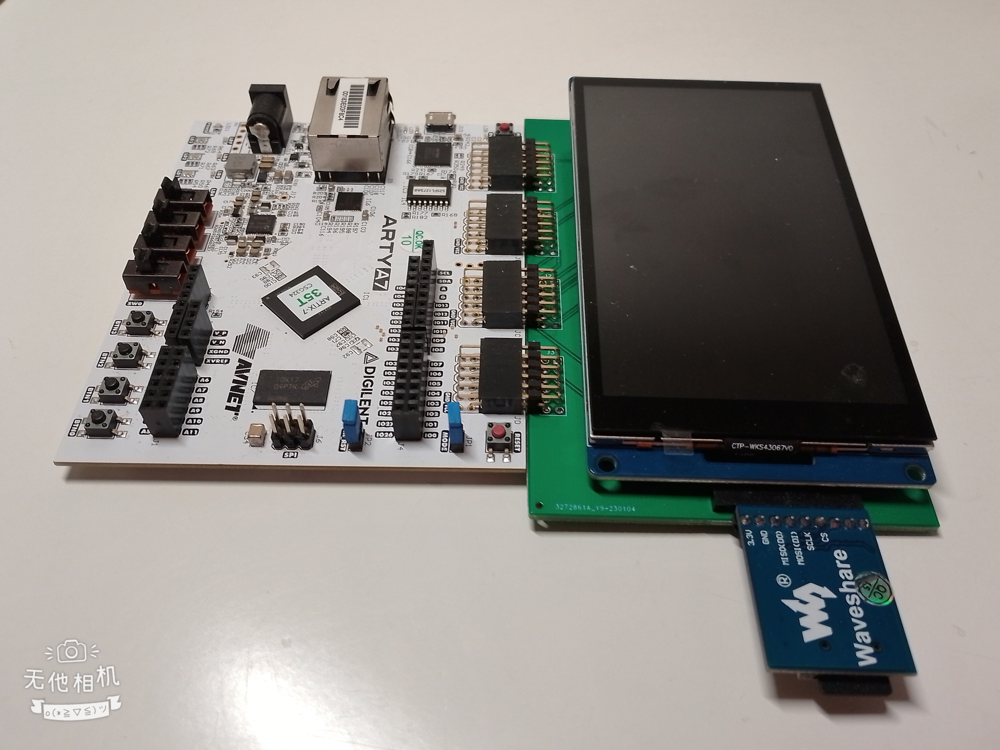

# xia
## X inside Architecture

## Description
xia (also known as X inside Architecture) is a family of grid instruction set computer (GISC) instruction set architectures.

## Overview
xia is designed to be the barebone of any quantum device. xia_1st is designed to be a workable architecture which allows users to perform basic touch, display and wireless feature. xia_1st allows developers to connect various modules via FSMC, DDR, TTL, SPI, TWI and GPIO. A workable demo is performed by the FPGA board arty 35.

## Demo
<a href="repo/demo.mp4">Click to download the video</a>

## Preface
In order to start the demo, you may need to properly setup your working environment beforehand. The extension board is taylormade for the ease of connecting wire. Please feel free to download the cad file and print it yourself. If you are okay to connect the jumper wires, which is about 40 of these, it should work too.

## Environment

### HW(Hardware) Requirements
Arty 35T  


Alientek TFT LCD 4:3 800x480(NT35510+GT9117)  
  

Waveshare MMC Module for the FPGA Board  


Extension Board Or Direct GPIOs  


MMC reader for computer  


micro USB Cable  


Altogether  



### SW(Software) Requirements

Ubuntu
```
# gcc
sudo apt install gcc

# openfpgaloader
sudo apt-get install libftdi1-2 libftdi1-dev libhidapi-hidraw0 libhidapi-dev libudev-dev zlib1g-dev cmake pkg-config make g++
git clone https://github.com/trabucayre/openFPGALoader.git
cd openFPGALoader
mkdir build
cd build
cmake ../ 
cmake --build . -j$(nproc)
sudo make install

# hexedit
sudo apt install hexedit
```

## Run the demo 

1. Connect the mmc card to your computer via a card reader or something similar.
2. Then, start the console/terminal and go to "sdk/compiler" from the repository.
```
cd sdk/compiler
```
3. Compile and upload the image to your mmc card
```
sh hack.sh
sudo dd if=darklain of=/dev/<mmc drive>  bs=1M
```
4. Remove and connect the mmc to the arty 35
5. Connect the micro usb cable to the arty 35 board and your computer.
6. Load the bitstream to your FPGA board
```
openFPGALoader -b arty -f black.bit
```
8. Compile bootloader
```
cd sdk/bootloader
sh hack.sh
```
9. Memory initialize with the generated file bram.coe.
(Please refer to <a href="https://docs.xilinx.com/v/u/en-US/pg058-blk-mem-gen">Block Memory Generator Guide</a> from the official website of Xilinx)

## GISC
GISC contains 4 core opcodes which are op_set, op_cpy, op_phy and op_jmp.

| Opcode | Hex | Meaning | Description |
| :--:|:-:|:-:|:-:|
| OP_SET  |0| Set | Set value opval0 to opval1  |
| OP_CPY  |1| Copy | Copy value from opval1(Internal Matrix) to opval0 |
| OP_PHY  |2| Phys Interface | Copy value from opval1(Phys Interface) to opval0 |
| OP_JMP  |3| Jump | Jump to preset Address |

## Code for bootloader

In order to speed thing up by the internal matrix(similar to cache), the bootloader is created and acted like a virtual machine which packed up the often used clustering opcodes to one function. The bootloader recognized the following codes.

| Opcode | Hex | Meaning | Description |
| :--:|:-:|:-:|:-:|
| OP_DMY  |0| Dummy | Do nothing |
| OP_ASN  |1| Assign | Assign value from opval1 to opval0 |
| OP_CPY  |2| Copy | Copy value from opval1 to opval0 |
| OP_GO   |3| Go | Jump to preset Address |
| OP_TAG  |4| Tag | Load pre-built function from the cache |
| OP_PTS  |5| Pointer Set | Set Pointer opval0 to opval1 |
| OP_PTG  |6| Pointer Get | Get Pointer opval1 and Set opval0 to its value |
| OP_B2M  |7| Block to Memory | Get the block from the mmc and load it to the ddr memory |
| OP_M2B  |7| Memory to Block | Get the block from the ddr memory and write it to the mmc |

The syntax of the code would be like this.

| operation | value 0 | value 1 |
| :--:|:-:|:-:|
| opcode  | opval0 | opval1 |


## Error Lang

The compiler included is developed to compile **error** language, which is used to generated machine code for xia bootloader. **Error** is designed to be a C-Like language. It's sufficient to create basic led on/off or even a full-suite operating system. **Error** is case-sensitive, so var_a and var_A are different. A single line comment starts with "//".


### Getting Started

### Filename extension 
Every file in **error** language should end with err.  
ex. filename.err  

### Include header file
To include another header file, a pound sign, a keyword "link" and the header file within a pair of angle brackets is needed.  
```
#link <header.err>  
```
### API
Here comes the pre-built functions for users.

**chkc(variable,index)**: //check the input character from uart rx<index> and return the rx<index> status to v
```
//v would be either 1 or 0
chkc(v,0); 
```

**setc(variable,index)**: //print the variable v to uart tx<index>
```
//Based on Ascii table, The output character would be 'A' if the variable v is 65 as a decimal.
setc(v,0); 
```

**getc(variable,index)**: //get the input character from uart rx<index>, and set the variable to v
```
//Based on Ascii table, The variable would be 'A' if the input character is 65 as a decimal.
getc(v,0);
```

**assign**: //assign variable b or number to variable a
```
assign(a,b);
assign(a,3);
```


**arith**: //define the operator with c, then assign the result from a and b to a 
```
arith(a,b,c);
```

**add**: //adding two numbers and set the result to a
```
add(a,b);
add(a,3);
```

**sub**: //subtracting two numbers and set the result to a
```
sub(a,b);
sub(a,3);
```

**mul**: //multiplying two numbers and set the result to a
```
mul(a,b);
mul(a,3);
```

**div**: //dividing two numbers and set the result to a
```
div(a,b);
div(a,3);
```

**mod**: //mod two numbers and set the result to a
```
mod(a,b);
mod(a,3);
```

**drawBlk**: //load data from the mmc block with position a.Then, draw it to screen with starting pixel a and ending pixel b.
```
drawblk(a,b,c);
```


**chkNoTouch**: //check if touch event exists, set the variable to the returned value, 
1 == untouched, 0 == touched
```
chkNoTouch(v)
```

**getTouch**: //get the coordinate if a touch is detected. Then, set a to x and set b to y
```
getTouch(a,b);
```

**drawFill**: //fill screen with color. a indicates color code. b indicates starting pixel. c indicates ending pixel.
```
drawFill(a,b,c);
```

**drb**: //load specific block from the mmc b and draw to the screen based on position a
```
drb(a,b);
```

**gpioSet**: //Set the target gpio to on or off
```
//0 == all off, 136 == 0b10001000 means to turn off all gpios except the fourth and the eighth one.
gpioSet(0);
gpioSet(v);
```


**gpioGet**: //Get the value of the target gpio and set v to it
```
gpioGet(v);
```

**anaSet**: //Set the target analog pin to the desired output from 0 to 255.
```
//255 == max, 0 == min
anaSet(0,255);
anaSet(v,255);
```

**anaGet**: //Get the current input of the target analog pin and save it to v
```
anaGet(v,index);
anaGet(v,21);
```

**pts**: //Set the pointer a to b
```
pts(a,b);
```

**ptg**: //Get the pointer b and set a to it
```
ptg(a,b);
```

**blk2Mem**: //Read Block from the mmc b and write it to the ddr memory a
```
blk2Mem(a,b);
```

**mem2Blk**: //Read Block from the ddr memory b and write it to the mmc a
```
mem2Blk(a,b);
```

**assignNum**: //Assign number b to the variable a based on its base type c: 0 == decimal, 1 == hex, 2 == octal
```
assignNum(a,2b,1);
```

**spiSet**: //Set the SPI output pin b to the variable a.
```
spiSet(a,b);
```

**spiGet**: //Get the value of the SPI input pin and set b to it
```
spiGet(a,b);
```

**chkSpi(variable)**: //check if the input queue from spi is empty
```
//1 == existed, 0 == empty
chkSpi(v); 
```

**twiSet**: //Set the TWI output pin b to the variable a.
```
twiSet(a,b);
```

**twiGet**: //Get the value of the TWI input pin and set b to it
```
spiGet(a,b);
```

**chkTwi(variable)**: //check if the input queue from twi is empty
```
//1 == existed, 0 == empty
chkTwi(v); 
```

**blk2Draw**: //load data from the mmc block with position b and draw it to screen with starting pixel a
```
blk2Draw(a,b);
```

**drawMem**: //load data from the memory with position b and draw it to screen with starting pixel a
```
drawMem(a,b);
```

### Keywords


**if**: //start the "if" condition 
```
if(a==0){
}
```

**else**: //branch for the "if" condition
```
if(a==0){
}else{
}
```

**else if**://branch for the "if" condition with another condition
```
if(a==0){
}else if(a==1){
}
```

**while**: //start the "while" loop
```
while(a>0){
}
```

**func**: //function begin
**end**: //function end
```
func testFunc();
	chkc(v,0);
end();
```


Code Example


## Tutorial

For all the tutorials, the workflow are the same. The only differences is the **lain.err** file.


### Example: Hello World

```
print("hello world");
```


### Example: GPIO
```
gpioSet(0);
```

### Example: Touch
```
assign(b,0);
while(1==1){
	chkNoTouch(a);
	if(a==b){
		getTouch(x,y);
		setc0(x);
	}


}
```
### Example: Pointer
```
assign(a,16774146);
assign(b,30);
assign(c,55);

pts(a,b);
ptg(c,a);

setc0(c);
setc0(a);
```
### Example: Draw 
```
assign(xs,0);
assign(ys,0);
assign(xe,479);
assign(ye,799);

assign(s,xs);
assign(e,xe);

	
mul(s,65536);
add(s,ys);

arith(e,16,34);
add(e,ye);

drawFill(0,s,e);
assign(d,0);
while(d < 50){
	add(d,1);
}
```

### Example: Calculation
```
assign(a,33);
assign(b,22);
add(a,b);
setc0(a);
```

### Example: Draw Text
```
#link<font.err>

fontSetup();
assign(a,491594);
assign(b,0);
drb(a,b);
```
### Example: Load Data from MMC to Memory
```
assign(block,0);
assign(memory,12582912);
blk2Mem(memory, block);
ptg(out,memory);
setc0(out);
```
### Example: Save Data from Memory to MMC
```
assign(block,491000);
assign(memory,12582912);
assign(out,1);
pts(memory,out);
assign(memory,12582912);
mem2Blk(block, memory);
```
		
### Example: function
```
#link<font.err>

fontSetup();
assign(a,491594);
assign(b,0);
drb(a,b);
```
### Example: Multiple Files
```
#link<font.err>

fontSetup();
assign(a,491594);
assign(b,0);
drb(a,b);
```
### Example: nested if
```
if(A > B){
	setc0(50);
}else if(A==B){
	setc0(60);
}
```
### Example: nested loop
```
assign(a,0);
assign(b,0);
while(a<25){
	while(b<20){
		setc0(b);
		add(b,1);
	}
	setc0(a);	
 	add(a,1);
}
```


